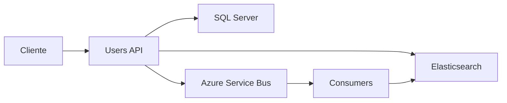
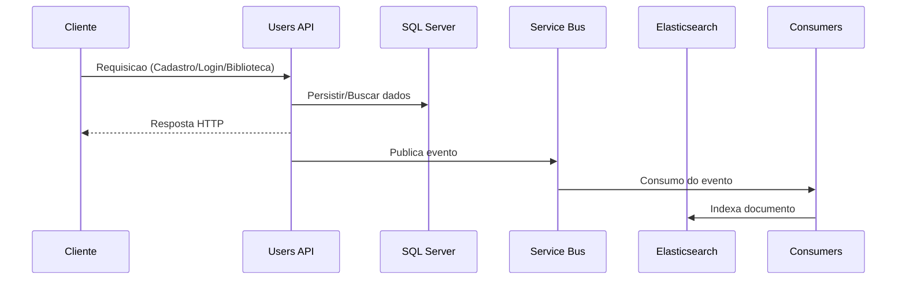
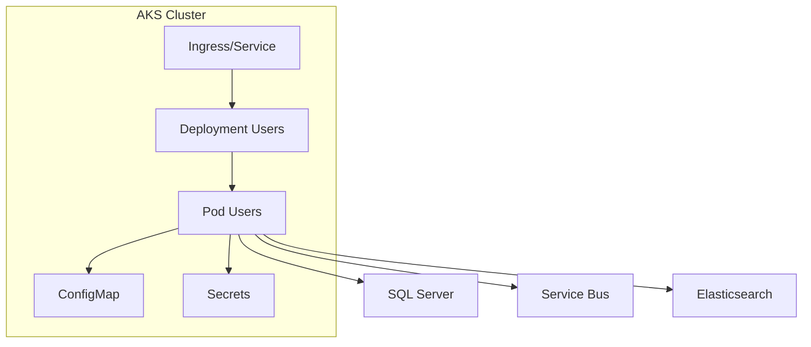

# FiapCloudGames.Users

API de Users do projeto FiapCloudGames. Responsavel por cadastro, autenticacao, biblioteca e integracao com Service Bus e Elasticsearch.

## Conteudo

- Visao geral
- Estrutura do repositorio
- Requisitos
- Executar localmente
- Testes
- Docker
- Kubernetes (AKS)
- Configuracoes
- Pipelines

## Visao geral

Este servico expoe endpoints REST para operacoes de usuarios, autenticacao e biblioteca. Ele utiliza:

- SQL Server para persistencia
- Azure Service Bus para mensageria
- Elasticsearch para historico e sugestoes (quando habilitado)

## Arquitetura e fluxo



## Fluxo da aplicacao



## Estrutura do repositorio

- src/FiapCloudGames.Users.Api: API Web
- src/FiapCloudGames.Users.Application: regras de negocio
- src/FiapCloudGames.Users.Domain: modelos de dominio
- src/FiapCloudGames.Users.Infrastructure: persistencia e integracoes
- src/FiapCloudGames.Users.Shared: contratos e utilitarios
- tests/FiapCloudGames.Users.Tests: testes automatizados
- k8s/: manifests Kubernetes
- pipeline/: Azure Pipelines

## Requisitos

- .NET SDK 8.x
- Docker
- kubectl
- Azure CLI (para AKS)

## Executar localmente

1) Restaurar dependencias:

```bash
dotnet restore FiapCloudGames.Users.sln
```

2) Executar a API:

```bash
dotnet run --project src/FiapCloudGames.Users.Api/FiapCloudGames.Users.Api.csproj
```

## Testes

```bash
dotnet test FiapCloudGames.Users.sln -c Release
```

## Docker

Build da imagem:

```bash
docker build -f src/FiapCloudGames.Users.Api/Dockerfile -t fiap-cloud-games-users:local .
```

Executar localmente:

```bash
docker run -p 8080:80 fiap-cloud-games-users:local
```

## Kubernetes (AKS)

Manifests estao em k8s/.

Aplicar:

```bash
kubectl apply -f k8s/configmap.yaml
kubectl apply -f k8s/service.yaml
kubectl apply -f k8s/deployment.yaml
kubectl apply -f k8s/hpa.yaml
```

Verificar rollout:

```bash
kubectl rollout status deployment/fiap-cloud-games-users
```

## Arquitetura no Kubernetes



## Configuracoes

Variaveis principais (exemplos):

- ConnectionStrings__DefaultConnection (Secret)
- ServiceBus__ConnectionString (Secret)
- Elasticsearch__Uri (ConfigMap)
- Elasticsearch__IndexName (ConfigMap)
- JwtSettings__SecretKey (Secret)
- JwtSettings__Issuer (Secret)
- JwtSettings__Audience (Secret)

## Pipelines

O pipeline esta em pipeline/azure-pipelines.yml e executa:

- Build
- Testes
- Build/Push da imagem
- Deploy no AKS (branches develop e main)
